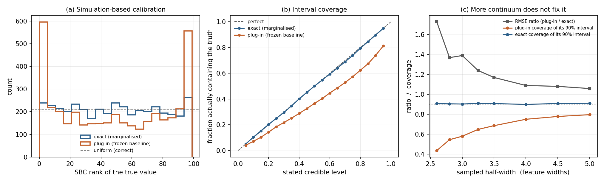

# Posterior calibration lab

**RMSE is not validation.** This package builds an approximate posterior whose
point estimates are within 11% of optimal, and then shows that its stated 90%
credible intervals contain the truth 74% of the time.

It exists to make one methodological point: the metrics normally used to judge an
inference pipeline cannot detect the failure that matters most for interpreting a
physical parameter.

> **Scope.** This is independent portfolio software written to demonstrate
> inference-validation practice. The forward model is a deliberately minimal
> stand-in, not a physical simulator, and the package makes no astrophysical
> claim. What is meant to transfer is the diagnostic harness, which is
> estimator-agnostic and works against any simulator.

---

## The setup

A localised feature of unknown amplitude `A` sits on a poorly known baseline `b`,
observed through noise:

```
y_i = A * g(x_i) + b + eps_i        eps_i ~ N(0, sigma^2)
```

`A` is the parameter of interest and `b` is a nuisance. Two estimators are
compared.

| | how the nuisance is handled |
|---|---|
| **exact** | `b` is marginalised out. For this Gaussian linear model that is analytic, so the posterior is correct by construction. |
| **plug-in** | `b` is estimated once from the feature-free wings, then frozen and treated as known. |

The plug-in is not a strawman. Estimating a continuum from line-free regions and
then proceeding as though it were exact is ordinary practice, it is fast, and it
is very nearly unbiased.

## The result

With 4,000 simulations at the nominal design:

| | exact | plug-in |
|---|---:|---:|
| RMSE | 0.1266 | 0.1406 |
| bias | +0.0021 | +0.0023 |
| correlation with truth | 0.9922 | 0.9904 |
| **coverage of the stated 90% interval** | **0.897** | **0.739** |
| **SBC uniformity p-value** | **0.14** | **0.0** |

Every metric in the top block says the two methods are equivalent. The plug-in is
11% worse in RMSE, which is not a difference anyone would act on, and its bias and
correlation are indistinguishable.

Every metric in the bottom block says one of them is broken.

<p align="center">
  
</p>

**(a)** Simulation-based calibration. A correct posterior gives uniform ranks. The
plug-in piles up at both edges, the signature of a posterior that is too narrow:
the truth keeps falling outside it.

**(b)** Coverage. The exact posterior tracks the diagonal. The plug-in sits below
it everywhere, so every stated credible level is an overstatement.

**(c)** The part that is easy to get wrong. As the sampled range widens, the RMSE
ratio converges towards 1 and the two methods look ever more alike. Coverage does
not follow. Even with the widest continuum tested, at a 6% RMSE penalty, the
plug-in's 90% interval is an 80% interval and SBC still rejects it at p ≈ 5e-30.
**Collecting more data narrows the gap in point estimates without fixing the
calibration.**

## Why simulation-based calibration

Following Talts et al. (2018): if a posterior is correct, then drawing a
parameter from the prior, simulating data from it, and ranking that parameter
within its own posterior gives uniform ranks. Non-uniformity is a fault in the
inference, not in the data. It requires only the ability to sample the prior,
simulate, and sample the posterior, so it applies unchanged to an amortised
neural posterior where no likelihood is available.

The control matters as much as the result. `test_exact_posterior_passes_its_own_calibration_check`
asserts that the diagnostics clear a posterior that is correct by construction. If
that test failed, the verdict on the plug-in would be worthless.

## Run it

```bash
pip install -e ".[dev]"
pytest -q                                   # 15 tests
python scripts/run_demo.py --output-dir products
```

Deterministic given `--seed`. CI runs lint, tests and the demo on Python
3.10 to 3.13.

## Layout

```
src/sbical/simulator.py     forward model, priors, degeneracy index
src/sbical/posteriors.py    exact marginal posterior; plug-in approximation
src/sbical/diagnostics.py   SBC ranks, coverage curves, point-estimate metrics
tests/                      15 tests, including the self-validation control
scripts/run_demo.py         produces products/metrics.json and the figure
```

## What this does not do

- It does not model any astrophysical process.
- It does not implement neural posterior estimation. The diagnostics are
  estimator-agnostic by design and would attach to one unchanged, but no such
  claim is tested here.
- It treats the feature position and width as known, so it isolates nuisance
  handling rather than shape fitting.
- The Gaussian linear model was chosen precisely because the exact answer is
  available. On a real simulator it would not be, which is the situation the
  harness is for.

## Licence

MIT.
